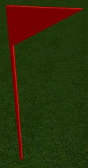
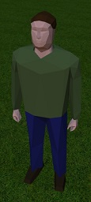
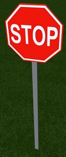
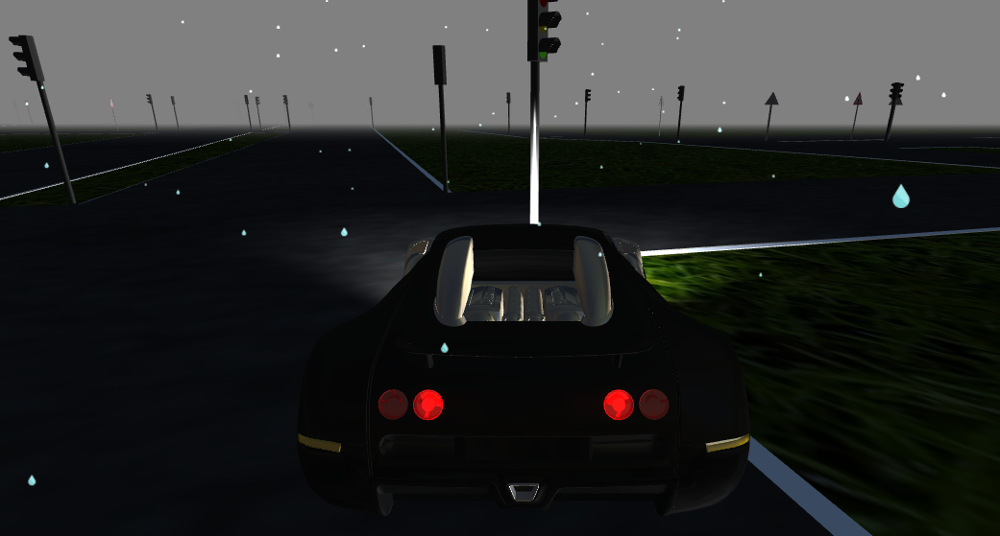
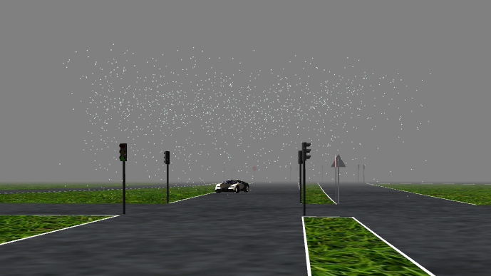
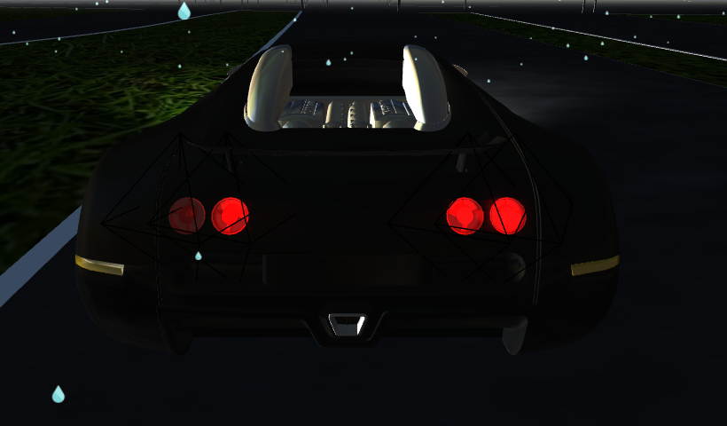

# Contents - Phase 1

1. [Scene building and animation](#scene-building-and-animation)
2. [Environment](#environment)
    * [Terrain](#terrain)
    * [Streets](#streets)
3. [Objects](#objects)
    * [Pedestrians](#pedestrians)
    * [Street signs](#street-signs)
    * [Traffic lights](#traffic-lights)
    * [Blender](#blender)
4. [Car](#car)
    * [Car building](#car-building)
    * [Car controller](#car-controller)
5. [Weather](#weather)
6. [Lighting](#lighting)
    * [Day-night lights](#day-night-lights)
    * [Car lights](#car-lights)
7. [Screenshots](#screenshots)
8. [Communication with the Server](#communication-with-the-server)
    * [REST services](#rest-services)
    * [Opening a WebSocket and subscription to events](#opening-a-websocket-and-subscription-to-events)
    * [Handling server data](#handling-server-data)
    * [Simulation control and Caching](#simulation-control-and-caching)

## Scene building and animation
Scene building is implemented in `index.html` file. The Three.js object to be rendered are implemented along with providing some user interface (buttons, key listeners, etc.) and handling server data.

Handling the server responses is done by the DataModel, but in index.html all the specific listeners have to be defined and attached to the DataModel, along with the _onDataProcessed_ and _afterEachFrame_ functions (if needed).

Loading the environment is requested by default, when the page is loading.

## Environment
Environment section includes building the terrain- and street-map.

### Terrain

The terrain currently is a plane map. It is built in **EnvBuilder** class via _addTerrain_ function.

The data required to build the terrain map comes from the server as _bounds_ and _heightMap_ data. Currently only the _bounds_ data is received, therefore the bounds-handler invokes the terrain building.

Future implementation should combine both the _bounds_ and _heightMap_ data, in order to make the terrain _bumpy_, i.e. to apply height data.

### Streets
Streets are getting build via **EnvBuilder** class.

A handler to the **DataModel** must be attached in order to build streets when the map data is received on the client.

The streets data comes in an array, in which each element represent a node with position (with x, y, z coordinates).

In **DataModel** a _parser_ function is attached in order to prepare the raw data to an array of **THREE.Vector3**. The streets then are getting build by executing _drawRoad_ function of the **EnvBuilder**.

Building the road is achieved by creating an underlying plane (white plane by default), which is wider than the road in order to provide side lines. After preparing the underlying plane the _drawShape_ function is invoked to build it first and then build the road on the top of it (the underlying plane has the **y** coordinate value decrease with 1, in order to keep it under the road).

**Obsolete or deprecated functions:**

* _add_ function - adding a block texture. Currently not in use, because we need an arbitrary shape texture to be added when we build the streets and a special terrain handling when we build the terrain
* _drawLine_ function - draws middle lines on the streets. Due to a huge overload of meshes, we do not use it.

## Objects
All our objects (except cars) are built in the **MeshBuilder** class. A 3D-Software called **Blender** was used to export the models as _.json_ files, which are then loaded with a **THREE.JSONLoader**. More information regarding Blender is contained in the [Blender](#blender) part.
Currently there are **27** different objects, but only **8** are in use. To get an overview over the available objects see _img\textures\Blender_ directory. 

The exported _.json_ consists of several arrays most importantly containing the **vertices**, **faces**, **materials** and **uvs** (needed for mapping an image) of the mesh. A parameter **mapType** tells the **MeshBuilder** if an image needs to be mapped. If that's the case a **THREE.TextureLoader** is used to load the image and is placed according to the information in the _.json_.

Additionally there is the possibility to randomize the used texture. A parameter **randRange** defines the number range in which a texture is chosen, but therefore the different textures have to be present and named accordingly.

An object can simply be added by calling the corresponding _add_ function:

        meshBuilder.addTree(1, { x:100, y:0, z:100 }, { x:0, y:math.pi, z:0 })
        
This for example places a tree with id 1 on the given position and rotation. (It should be noted that this id is saved to a specific variable `mesh.projectID`, because Three.js occupies the `mesh.id` variable with internal id's.)

To access the objects later on, they get saved in an array **meshArr**.

It's important to know that we've limited the objects for performance reasons. Change the numbers at your own discretion. They are found in the handler part of the `index.html` (signs: 200, pedestrians: 100).

#### Debugging
For testing/ debugging there exists a simple **dummy** object. It looks like the following, with an arrow to indicate a direction:

Furthermore in `index.html` the _lineDbg_ function can be used to draw a colored line between two points to help visualize a relation of some things.

### Pedestrians
Pedestrians are not part of the initial world. They are initialized when the simulation is started. With every frame the data is processed by `DataModel.js` and passed to a handler. In there we check with the id's wether:

* the pedestrian already exists and thus update its position to the associated coordinates
* it doesn't exist yet and simply create a pedestrian at the position

The initial models of the pedestrians were way too detailed which caused issues with performance. After discarding the texture mapping, that was used at first, and some remodeling (250kb > 16kb) of the mesh we ended with the following basic, male pedestrian:
(there was no time to also remodel the female pedestrian)

(The color of some clothing is generated randomly to get some variety into the visualization)

A thing that didn't work out in the span of this lab was the **animation** of pedestrians. Blender supports the creation of animations and there also are Three.js examples of them working. 
But here we couldn't get it to run. This problem is not unknown and some people reported past changes to the exporter as reason.

### Street Signs
The collection of objects consists of **20** different street signs officially used in german traffic. The models are very simple. 
The _.json_ file contains the geometry and the corresponding _.png_ image is mapped onto the object to give the sign it's actual meaning.

A stopsign for example looks like this:
    

Street signs are loaded with the initial environment and we decided to just place signs on intersections. In future labs this surely can be expanded.

The handler taking care of the roads also handles the placement of signs. For the placement every node contains an object **streetSign**, like this:

        "streetSign":{"type":"INTERSECTION_SIGN","id":-1,"one":false,"two":true,"y1":4.9E-324,"z1":4.9E-324,"x1":4.9E-324,"y2":831.6952128664457,"signState":"INTERSECTION_SIGN","x2":1465.67280883304,"z2":0.0}}
        
Signs always have an **id** of -1, because they don't need to be accessed later on. The exact positions of the signs is computed beforehand and sent as the coordinates **x1,y1,z1** and **x2,y2,z2**. 
The variables **one** and **two** decide if the corresponding coordinates are used and the idea is that they are related to the two lanes of a street (right and left lane). This way a street has the right sign on both sides of the intersection.

In most cases this placement works acceptable, but in some cases the assortment of roads on intersections completely messes up the signs. This leaves another task open for the next lab.

### Traffic Lights
Traffic lights are basically just a different **type** of streetsigns. They get placed the same way but receive an **id** and the **signState** now has a meaning.

        {"type":"TRAFFIC_LIGHT","id":676, ... ,"signState":"TRAFFIC_LIGHT_GREEN"}}

The plan was to make the traffic lights show their actual state with different lights. Each frame was supposed to contain information about which traffic light should switch it's state based on their id. 
The problem was that Three.js has internal limitations that affect the amount of lights (**THREE.SpotLight**) we can have in our visualization and it caused the shader to crash.

The implementation for the lights (traffic lights/ street lamps) is therefore disabled in `MeshBuilder.js`.

A possible solution for traffic lights could be to change the material of the individual "lamps" to a color with higher emission values and update the object again.
Sadly there was not enough time to solve this problem.

### Blender
**!** This passage contains basic information about the use of Blender. If the current objects are sufficient and no new meshes need to be added, there is no necessity for the following. **!**

---
[Blender](https://www.blender.org/) is a free, open-source 3D-Software. The models used were free templates that mostly got remodeled to be more performant (lower polygon count). 
The [exporter](https://github.com/mrdoob/three.js/tree/master/utils/exporters/blender) used to create the .json files was made by Mr.doob and needs to be installed as plugin to Blender.

Learning Blender is sometimes compared to rocket science, but to do the basic operations you don't need much knowledge. 

* Load the .blend of the template (or import other formats if supported)
* (if needed change some colors)

    
    
* if the mesh is only partially UV mapped (like our signs) the UV material name needs to contain _"Map"_ or _"map"_
* the mesh needs to be one whole: select all parts (Shift+Rightclick) > Ctrl+J
* File > Export > Three.js (**settings:** 

    * Normals can be disabled in most cases
    * UVs can be disabled if you don't have any image mapping
    * enable Face Materials)
    
To be able to do anything beyond that (remodeling meshes/ changing UV mapping) you need basic knowledge about the software, but there are plenty of beginner tutorials out there for that.
   

---

## Car
Cars in our implementation are handled separated than other object. We have two main classes - one for building (creating) a car and one for handling its movement.

### Car building
A _Car_ is build by a **CarBuilder** class. In it we load predefined materials and also define several types of cars (i.e. car models and specifications).

An example of building a car is as follows:

        carBuilder.build(1, 'veyron', 5, { x:0, y:0, z:0 }, scene)

where the _type_ ('veyron') and the _initMaterial_ (5) can be skipped, while the other parameters are mandatory. When the type of the car or its initial material are skipped, a random value will be assigned.

The function _configVeyron_ and _configGallardo_ is mainly used for the purpose of manual control of car movement, which is currently removed from our code. Except for the **MAX_WHEEL_ROTATION** setting, which we are still using in `CarController.updateCarModel`, it won't have any effect if you adjust any other parameters in these two configuration functions.

### Car controller
The CarController module is responsible for calculating the car movement. There are three functions that are mainly used. They are _addCar_, _handleData_ and _update_.

##### Car registering
All car objects should be registered by calling:

        carController.addCar(carName, car)

The **carName** is an identifier of that car in **CarController**. The **car** is an instance returned by `CarBuilder.build`. This module will render all registered cars to the screen.

##### Server data handling
The data frame from server will first be processed by `DataModel.js` module where the coordinate system of servers get converted into ours, the conversion contains 2 steps:

1. switch **y** and **z** axis
2. convert data unit from **meter** into **centimeter**

The processed data and a callback will then be passed into _handleData_. This handler simply store the received data for corresponding car instance. This data will be consumed when the car finished rendering previous data frame. Special case is that if the received data frame is the first one for the corresponding car, it will be used directly for calculating the attitude of that car.

As for the callback, it should be called when the car reached its destination of current data frame, in order to require the next data frame from the server.

##### Car attitude rendering
The _update_ function will be called in every frame in order to update the car attitudes.

The mechanism is as followed: For each phase we consider 2 data frames received form the server, the first one contains information about the car at a start point, the second one contains the information about the car at destination. At beginning and destination, the attitude of the call will be corrected to be the same as what server told. In between we calculate the position, speed, rotation, steering... of the car and render it to the screen, 'driving' the car to its destination.

The reason why we implemented it this way is that it's hard to require car information 60 times per second from the server and process it while keeping the visualization running smoothly.

Normally the distance between start and destination varies from **1cm** to **20cm**, the longer this distance is, the better the movement looks. I would suggest at least **200cm** for a better visualization result. But also, the longer this distance is, the more inaccurate of the visualization result will be. Because the movement between 2 data frames that we visualized mainly based on client calculation, it does not guarantee that it is what really happens in the simulation. It only guarantee that the car at the beginning(start and destination) of every data frame is the exactly the same as in the simulation.

The most part of car information received from the server can be applied to the car directly, only for the rotation we have to calculate it before apply to the car. But the calculation is simple, we just apply the initial orientation vector `(0, 1, 0)` to the rotation matrix received from the server as followed:

        var rotationMatrix = new THREE.Matrix3();
        var matrixElements =  rotation.reduce(function(acc, val){ return acc.concat(val)}, []);
        rotationMatrix = rotationMatrix.set.apply(rotationMatrix, matrixElements);
        var nextOrientation = initialOrientation.applyMatrix3(rotationMatrix);

The `nextOrientation.y` contains the information we need to render the orientation of corresponding car.

The calculation for each rendered frame is implemented in _updateCarModel_. One thing to be noticed: in the current code we made the speed 100x so fast than the original speed, so that human eye can notice that the car is actually moving. It can be changed in the fifth line of function _updateCarModel_, since the speed and acceleration given by the server uses **second** as unit, but the **delta** is given in **millisecond**, so the actual time delta should be **delta/1000**.

## Weather
In our implementation we have one weather state available: **rain**. The rain gets rendered when the _raining_ flag in the current JSON frame is set to **true**. The corresponding _DataModel.RAIN_HANDLER_ in the index.html then starts or stops the rain based on the data in the _raining_ flag. This handler is set in the _DataModel.js_. The controller, which is responsible for enabling, disabling and positioning of the rain, is the **RainController** (RainController.js). This file consists of two important functions to start and stop the rain.

* _startRaining(scene, carPosition)_ -  adds the rain to the scene and changes the position of the rain to the position of the car
* _stopRaining(scene)_ - deletes the rain in the scene

Since we don't want to render the rain for the whole scene, we limit the rendering of the rain in a 1000 x 1000 x 750 (width x length x height) box. So we need the input parameter _carPosition_ in the function _startRaining_ to position the rain exactly above the car.
The boolean function _isItRaining()_ helps to check if the rain is now enabled or not. This is very helpful to check whether it is possible to start or stop the rain.

The rain is constructed as followed. First of all, when the application is started, the actual rain gets initialized with the **init** function of the RainController object in the index.html. The rain consists mainly out of one particle system. In your implementation we render **1300 particles** within this system. This can be adjusted using the private variable _particleCount_ in the RainController. This is achieved using the following code:

        particles = new THREE.Geometry();

        for (var i = 0; i < particleCount; i++) {
            //Raindrops above the car in 1000 x 1000 x 750 range
            var pX = Math.random() * 2000 - 1000,
            pY = Math.random() * 750,
            pZ = Math.random() * 2000 - 1000;
            var particle = new THREE.Vector3(pX, pY, pZ);
            particle.velocity = {};
            particle.velocity.y = 0;
            particles.vertices.push(particle);
        }

        particleSystem = new THREE.Points(particles, material);

Because we just initialize all the particles, we set the velocity of each particle to zero. With the first three code lines in the for loop the particles are placed **randomly** in the particle system. All the particles correspond to one **raindrop**.

**Important: The more particles get rendered, the more computational power is needed!**

To give the raindrops some style it is necessary to apply some material to each particle.

        var material = new THREE.PointsMaterial({
          color: 0xFFFFFF,
          size: particleSize,
          map: new THREE.TextureLoader().load(rainTexture),
           blending: THREE.AdditiveBlending,
           depthTest: false,
           transparent: true
        });

The _particleSize_ is adjustable to customize the size of the rendered drops. As a texture we use the following image, so the drop looks more realistic.

The important functionality of the RainController is to animate the raindrops. Without the function _simulateRain()_, the randomly placed raindrops would just stay in the air without any movement. To do the animation we execute this function in the main render loop of the application.

        var count = particleCount;
        while (count--) {
          var particle = particles.vertices[count];
          if (particle.y < 0) {
            particle.y = 750;
            particle.velocity.y = 0;
          }
          particle.velocity.y -= Math.random() * .20;
          particle.y += particle.velocity.y;
        }
        particles.verticesNeedUpdate = true;
        }

This animation is mainly done by decrementing the y coordinate of the particle. When the particle is arrived at the bottom ( y coordinate lower than zero), then this particle is again rendered at the top of the particle system box. As a summary a picture of the rendered rain.

*Above: rain simulation*

*Above: rendered particle system as a box above the car*

## Lighting

### Day-night lights

A **day and night circle** is implemented in our system. To enable this circle the boolean value _dayNightCircle_ in the index.html needs to be set to true.
Three different light sources are set in the scene.

* **Ambient light** - This light globally illuminates all objects in the scene equally
* **Directional light** - A light that gets emitted in a specific direction
* **Hemisphere light** - A light source positioned directly above the scene

        var ambient = new THREE.AmbientLight( 0xffffff, 0.2 );
        scene.add( ambient );

        directionalLight = new THREE.DirectionalLight( 0xffffff, 2  );
        directionalLight.position.set(0,1,1).normalize;
        scene.add( directionalLight );

        hemiLight = new THREE.HemisphereLight( 0xffffff, 0xffffff, 0.2 );
        hemiLight.color.setHSL( 0.6, 0.75, 0.5 );
        hemiLight.groundColor.setHSL( 0.095, 0.5, 0.5 );
        hemiLight.position.set( 0, 500, 0 );
        scene.add( hemiLight );

The **Ambient light** is used in our system to have a realistic light distribution, when the sun is disappearing. The _sun_ is represented by the **Directional light** above the scene. During the rendering of the scene this light is rotated around the z axis to achieved the day and night circle. At some time the sun is fully hidden ( = **night**) and fully seen ( = **day**).

### Car lights

The lights of a car are controlled by a **LightController**. Each car has an own LightController attached. Additionally three different lights are related to one car, which are then controlled by the corresponding LightController. This lights are available for one car:

* **Front light** - Two different point lights on the left and right side of the car + one cone to display the spreading of the light
* **In light** - Some light in the body of the car
* **Back light** - Four different point lights to represent the back light

*Above: Front light of the car*

*Above: Back light of the car*

*Above: In light of the car*

These lights are initialized at the beginning after the car is created. With the functions _addFrontLight_, _addBackLight_ and _addInLight_ the lights are attached to the car regarding some offset to the origin/position of the car. Additionally when the car drives, the lights are also moved by using the update functions in the LightController.

We implemented two other important functions to use the light. During the **night phase** in the application the **two inner back lights**, **front light** and the **in light** are turning on. The other way around when it's day.

When the car is turning left or right the corresponding attributes **moveLeft** and **moveRight** are set. Based on this value the back light is **blinking**.

        blink(car, "left");
        blink(car, "right");

## Screenshots
Our visualization involves the possibility to take screenshots.

To explain the basics:

A frame is calculated by a renderer who renders the scene from a given camera. 

        renderer.render(scene, camera);

 The main renderer does this the whole time in a loop to get a fluid scene. For a screenshot we simply take an additional renderer, that is set to render on an invisible canvas (to not screw up the main screen). 
Whenever a screenshot is asked for it renders one frame on the canvas and we use the _.toDataURL_ command to generate the corresponding _base64_ string out of it.

**! the renderer needs to be initialized with _preserveDrawingBuffer: true_ to be able to take screenshots !**

To accomplish our features we have two such additional renderer:

* ***rendererH:*** used to make normal screenshots with window size (shortcut P)
* ***rendererHLowRes:*** used for low res images (600x300px) which are used by computer vision group

To both of these can be applied a **THREE.StereoEffect** to split the screen and show two slightly relocated views. This is important for the computer vision group. 
They get a low res, stereo image as _base64_ with every frame on which they then do their calculations on. 

To get the screenshot there are two functions

    takeScreenshot( cam, type='image/jpg' );
    getScreenshotAsImg( cam, type='image/jpg' );

which are basically the same, except the first one directly downloads the _base64_ string as image through the browser. The latter one returns the raw _base64_ string.

The parameter **cam** is used to pass a camera (**THREE.PerspectiveCamera**) from which the picture is meant to be taken. For normal screenshots this would be the current camera, through which we see the scene. 

It is also possible to pass the _id_ of a existing car as **cam**. 
In this case it will always take a low res, stereo screenshot from a dashcam-position in front of the car. This is done by moving a particular camera _hCamera_ to the described position and rendering a frame through it.

## Communication with the Server
Server communication is implemented by using both REST services and WebSockets. We use several classes, which implement these functionalities.

### REST services
REST calls are able to be executed using the **WebService** class. It is a singleton, allowing us to make _HTTP_ requests.

The public interface of the class is as follows:

* _request_ - generic function for creating an HTTP. User should provide the method type, destination URL, parameters (data) to be sent and content type (optional). Parameters are handled as query-params, except a specific content type is set. **No defensive code**, therefore requesting with wrong parameters will lead to exceptions.
* _get_ - sending a _GET_ request to the server.
* _post_ - sending _POST_ request to the server.

The WebSocket class takes care of parsing the responses of the calls. If no content type has been set during sending the HTTP call, then the expected server data is in JSON format. After receiving a response, it is parsed and the attached listener is invoked with the parsed data.

Further public interface of this class is for working with the _WebSocket_ connection.

### Opening a WebSocket and subscription to events
Opening a WebSocket connection is done in the **Messaging** class. We use the STOMP broker to subscribe for specific events (in- and outcoming channels).

Using the **WebService** class we can attach listeners to specific channels (for which we have subscribed), send messages or execute commands.

The WebService' interface for the WebSocket is as follows:

* _WS_attachListener_ - attaching a listener on the _onMessage_ chanel of the WebSocket
* _WS_start_ - execute start command, i.e. request start simulation on the server
* _WS_stop_ - execute stop command - request stop simulation
* _WS_nextFrame_ - request next frame data
* _WS_screenshot_ - send a screenshot to the server

**NOTE:** `InitMessaging.js` is no more in use! But there is an implementation of using the _onCommand_ channel, in order to send screenshots on demand of the server.

### Handling server data
Handling of the server data is implemented in the **DataModel** class. It is a singleton object, playing the role of a global response listener. In order to handle server data, the DataModel must be attached to an HTTP call or WebSocket channel as a listener.

The DataModel keeps the parser functions for specific data type, expected to arrive in the server data. Auxiliary parsing functions are also implemented in the DataModel.

The main purpose of the DataModel is to parse specific server data and execute specific handlers on server response.

The public interface of the DataModel is as follows:

* _addHandler_ - adding a handler, for specific data type (key), to be executed when such data is available in a response of the server. **NOTE** that the type of data, to be handled, must be defined in the DataModel.
* _onData_ - attaching the DataModel as a global response listener. Whenever it is invoked, the DataModel will check the response data, parse it and execute the corresponding handlers (which have to be attached beforehand)

Each attached handler is wrapped as a _Promise_ object, i.e. it has to invoke _resolve_ or _reject_ functions in order to notify the DataModel about its state, i.e. the data has been successfully handled (resolved), or a problem has occurred (rejected).

On receiving data, the DataModel checks also whether the _onDataProcessed_ function is attached. This is a legacy functionality, which allows us to start rendering the scene, when we have specific data.

### Simulation control and Caching
In order to start or stop the simulation, the user have to click on the corresponding buttons, available on the screen.

Handling of the continuous execution of frames is implemented in the **DataModel** (can be separated in another module if the control becomes more complicated).

To make the simulation smooth, we implemented caching functionality in the DataModel. The way the simulation runs is as follows:

1. When the user has started the simulation, the DataModel asks for the first frame data.
2. On server response, the DataModel checks whether a cached frame data is available
    * if no previous frame is cached, then current data is cached
    * otherwise the attached handlers are invoked with the cached data, and the current one is getting cached.
    * _In any case, the DataModel asks for the next data frame
3. Step 2 is repeated until the user stops the simulation or the server returns `null` data.

When a server response arrives, the DataModel checks for available handlers and executes them. If all of the handlers have responded with _resolved_ status, the data has been handled correctly and the _afterEachFrame_ function can be executed (if attached beforehand). If at least one of the handlers fails to fulfill (i.e. call _resolve_), after a specific timeout or if _reject_ has been called, a error handler will be executed. Since an error handler is not implemented currently, the simulation will continue as described above, but _afterEachFrame_ function will not be called.

_afterEachFrame_ function is in the public interface of the DataModel. One can attach such function to be executed every time a frame data has been handled. In our implementation we use it to send screenshots to the server, every time we have successfully rendered a frame data.
